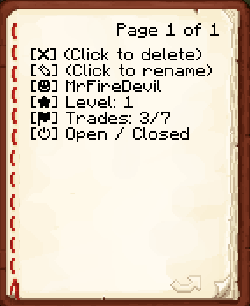

# Alioth

> [!CAUTION]
> This plugin is just a draft and currently not ready to serve on production or dev env

___

## Features
- Trader Level | More slots for trades
- Add own trades to list
- All trades saved in database (exposed)

## Todo
- [x] villager spawn via book
- [x] villager despawn via shift+right click
- [x] right click to open trade inventory
- [x] left click to change shop state (open/closed)
- [x] prevent villager move
- [x] prevent villager damage
- [ ] add limit for villagers and trade entries
- [ ] add particle / animation when stock is empty
- [ ] (?) disable physical currency
- [ ] backup system
- [ ] optimized code
- [ ] on spawn give random name

## Hidden commands
- [ ] ``/trade rename <uuid>`` - Open anvil inventory with name tag to rename the trader
- [ ] ``/trade delete <uuid>`` - Delete trader and drop book
- [ ] ``/trade ...``

## Ideas
- [ ] via name tag can change custom name
- [ ] via ITEM change type / profession from villager
- [ ] Shift+Right click to open book with many functions
  - Remove villager (only with permission)
  - Change custom name (only with permission)
  - Show owner name
  - Show level
  - Show current / max trade entries
  - Show statistics
  - ...

